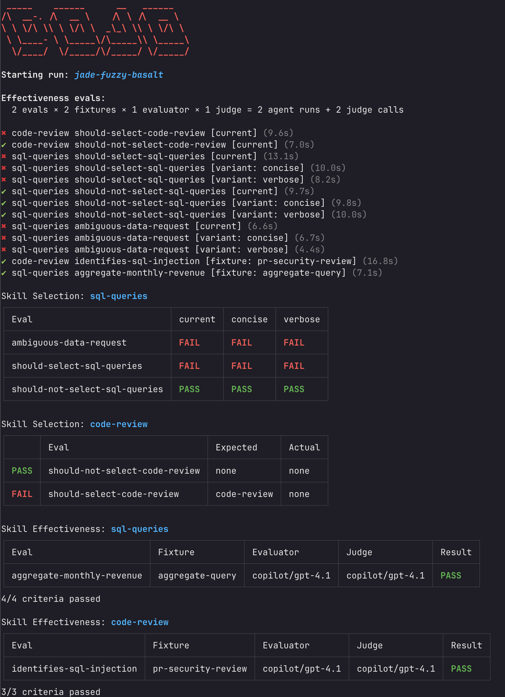

# Skills Dojo

A CLI for testing and improving AI agent skills. You write a skill, write evals against it, and Dojo tells you whether the skill works.

Skills follow the [Agent Skills specification](https://agentskills.io/specification).



## Install

```bash
npm install -g skills-dojo
```

## What it tests

**Selection evals** answer: does the agent pick the right skill for the job?

**Effectiveness evals** answer: does the skill actually help the agent produce correct output?

## Getting started

### Selection eval

Create a skill with a `SKILL.md` and an eval file:

```
skills/
  code-review/
    SKILL.md
    evals/
      selection.yaml
```

`skills/code-review/SKILL.md`:

```markdown
---
name: code-review
description: Review code changes for security, performance, and correctness issues.
---

# Code Review

Analyzes diffs and pull requests...
```

`skills/code-review/evals/selection.yaml`:

```yaml
evals:
  - name: should-select-code-review
    prompt: "Review this pull request for potential security issues and suggest improvements."

  - name: should-not-select-code-review
    prompt: "Write a Python function that calculates the Fibonacci sequence."
    assert: none
```

When `assert` is omitted, Dojo expects the agent to select the skill the eval lives under. Use `assert: none` to test that the agent does _not_ select any skill.

### Effectiveness eval

Add an `effectiveness.yaml` and fixture directories:

```
skills/
  sql-queries/
    SKILL.md
    evals/
      effectiveness.yaml
      fixtures/
        aggregate-query/
          tests/
            schema.sql
          golden/
            notes.md
```

`skills/sql-queries/evals/effectiveness.yaml`:

```yaml
evals:
  - name: aggregate-monthly-revenue
    prompt: "Write a SQL query that calculates total revenue per month from the orders table."
    criteria:
      - name: groups-by-month
        description: Uses GROUP BY with a date function to aggregate by month
        pass_threshold: 0.7
      - name: correct-columns
        description: Returns both month and revenue columns
        pass_threshold: 0.7
      - name: null-handling
        description: Handles NULL values appropriately
        pass_threshold: 0.5
```

The agent runs in a sandboxed temp directory with real tools (`bash`, `read_file`, `write_file`, `list_files`). Files from `tests/` become the agent's working directory. An LLM judge scores the result against your criteria. Put reference material in `golden/` to help the judge calibrate.

### Run it

```bash
dojo run
```

## Variants

Variants let you A/B test different skill descriptions. Useful for tuning the `description` field in your `SKILL.md`.

```yaml
variants:
  - name: concise
    value: Write and optimize SQL queries across all major database dialects.

  - name: verbose
    value: >
      Write correct, performant SQL across all major data warehouse and database
      dialects including Snowflake, BigQuery, Databricks, PostgreSQL, MySQL, and
      SQL Server.

evals:
  - name: should-select-sql-queries
    prompt: "Write a query that finds the top 10 customers by revenue using a window function."
```

Each eval runs once with the current skill description, then once per variant. Results show up in a matrix so you can compare.

### Run modes

Control which combinations run with `run-mode`:

| Mode | What runs |
|------|-----------|
| `all` (default) | Current description + all variants |
| `variants-only` | Variants only, skips current |
| `current-only` | Current only, skips variants |

## Decoys

Decoys are fake skills injected alongside real ones to test whether the agent can tell the difference:

```yaml
evals:
  - name: select-with-decoys
    prompt: "Review this pull request for potential security issues."
    decoys:
      - name: code-formatter
        value: Automatically format code to match style guidelines.
      - name: code-explainer
        value: Explain what a piece of code does in plain English.
```

## CLI

```
dojo run [skill]              Run evals (optionally filter by skill name)
  -e, --eval <name>           Filter by eval name
  -V, --variant <name>        Run only a specific variant
  -t, --eval-type <type>      Filter: "selection", "effectiveness", or "all"
  --selection                  Run only selection evals
  --effectiveness              Run only effectiveness evals
  -m, --evaluation-model       Override evaluation model
  -j, --judge-model            Override judge model
  --model-provider             Override model provider
  -f, --fixture <name>        Filter to a specific fixture
  --judge-filter <id>         Filter to a specific judge
  -p, --parallelism <n>       Max concurrent eval runs (default: CPU cores)
  --no-parallelism            Run sequentially
  -o, --output <path>         Write combined report JSON
  -i, --inspect               Show session events (tool calls, errors)
  --keep-sandbox              Keep sandbox temp dirs after run
  -y, --yes                   Skip confirmation prompts

dojo list                     List discovered skills and evals
dojo validate                 Validate skills and eval files
```

Global flags:

```
-s, --skills-dir <dir>    Override skills directory (repeatable)
-c, --config <path>       Path to config file
-d, --cwd <dir>           Working directory
```

## Configuration

Optional `dojo.toml` in your project root. Everything has sensible defaults, so you can skip this entirely until you need to customize something.

```toml
[skills]
# Default: searches skills/, .agents/skills/, .github/skills/, .claude/skills/,
#          .codex/skills/, .gemini/skills/, .openclaw/skills/, .opencode/skills/
dir = ['skills']

[model]
provider = 'anthropic'
evaluator = 'claude-sonnet-4-6'
judge = 'claude-opus-4-6'

[effectiveness]
warn_fixture_threshold = 4
confirm_fixture_threshold = 12

[reporting]
per-skill = true
consolidated = false
```

### Providers

| Provider | Setup |
|----------|-------|
| `anthropic` (default) | Set `ANTHROPIC_API_KEY` |
| `openai` | Set `OPENAI_API_KEY` |
| `copilot` | GitHub Copilot SDK |
| `vercel` | Vercel AI SDK. Use `<provider>/<model-id>` model strings (e.g. `openai/gpt-4o-mini`) |

## Eval schema reference

### File-level fields

| Field | Type | Default | Description |
|-------|------|---------|-------------|
| `model` | string | provider default | Model for the evaluator |
| `timeout` | number | `30` | Timeout in seconds |
| `skills` | `"all"` or `string[]` | `"all"` | Which skills to offer the agent |
| `run-mode` | `"all"`, `"variants-only"`, `"current-only"` | `"all"` | Which combinations to run |
| `variants` | `Variant[]` | -- | Variant definitions |
| `evals` | `Eval[]` | -- | **Required.** The eval definitions |

### Eval-level fields

| Field | Type | Default | Description |
|-------|------|---------|-------------|
| `name` | string | -- | **Required.** Eval identifier |
| `prompt` | string | -- | **Required.** The prompt sent to the agent |
| `assert` | `string[]`, `"none"`, `"any"` | `[skillName]` | Expected selection result |
| `model` | string | file-level | Override model for this eval |
| `timeout` | number | file-level | Override timeout |
| `skills` | `"all"` or `string[]` | file-level | Override available skills |
| `run-mode` | `"all"`, `"variants-only"`, `"current-only"` | file-level | Override run mode |
| `variants` | `"all"`, `string[]`, `Variant[]` | `"all"` | Which variants to run |
| `decoys` | `Decoy[]` | -- | Fake skills for discrimination testing |
| `enabled` | boolean | `true` | Skip this eval when `false` |

### Assert behavior

- **omitted** -- expects the skill the eval lives under
- **`"none"`** -- agent must not load any skill
- **`"any"`** -- agent must load something (any skill counts)
- **`["skill-a", "skill-b"]`** -- agent must load one of these

### Cascading

Fields cascade: eval-level beats file-level, file-level beats config, config beats defaults.

## Reports

Reports are saved per-skill after each run:

```
<skill-dir>/evals/reports/<run-id>/report.json
<skill-dir>/evals/reports/<run-id>/effectiveness-report.json
<skill-dir>/evals/reports/<run-id>/logs.json
```

## Documentation

Full docs at [skillsdojo.dev](https://skillsdojo.dev).
